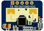

##  _Iavor Veltchev's Projects_

### MyLD2410 [&copy; 2024]

An Arduino library for the LD2410 presence sensor, including HLK-LD2410B and HLK-LD2410C.

[MyLD2410 Library](https://github.com/iavorvel/MyLD2410) on GitHub

[MyLD2410 documentation](https://iavorvel.github.io/site/MyLD2410/classMyLD2410.html)

---
### Tetris Ai [&copy; 2013]
Play against a Tetris AI engine, or watch it in action.

 [Play Tetris Ai](http://3.135.225.195/tetris)

---
### Othelo/Revresi Ai [&copy; 2017]

Play against an Othelo AI engine.

 [Play Othelo Ai](http://3.135.225.195/reversi)

---
### Blackjack Game [&copy; 2023]

 [Play Blackjack](http://3.135.225.195/bjack)

---
### TMR Wizard [&copy; 2013 - 2025]

 [TMR wizard](http://3.135.225.195/tmrwiz)
